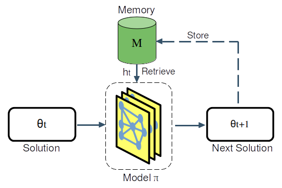

# MARCO: Memory-Augmented Reinforcement framework for Combinatorial Optimization

 

## Overview
MARCO offers an innovative approach to neural combinatorial optimization (NCO). It integrates a memory module that prevents redundant exploration and promotes the discovery of diverse, high-quality solutions across various problem domains. We include implementations of improvement methods for the maximum cut (MC) and maximum independent set (MIS), and constructive method for the traveling salesman problem (TSP).
<div align="center">
  
</div>

## Supplementary material
Access the supplementary material [here](Supplementary_Material_MARCO.pdf)

## Requirements
* PyTorch

## Usage

To train a model, run the following command inside a problem folder:

```bash
python train.py
```

To test a model, run:

```bash
python eval.py
```
### Configuration

To adjust training and evaluation settings, modify the parameters in:

-    *options/train_options.py*
-    *options/eval_options.py*

## MC Performance Table

The best results overall and the best results among learning-based methods are highlighted in **bold**.

| **Method**    | **ER700-800 Obj. ↑** | **Time** | **RB200-300 Obj. ↑** | **Time** | **RB800-1200 Obj. ↑** | **Time** |
|---------------|-----------------------|----------|-----------------------|----------|------------------------|----------|
| GUROBI        | 23420.17             | 1m       | 2024.55              | 1m       | 20290.08              | 1m       |
| GUROBI_long   | 24048.93             | 10m      | 2286.48              | 10m      | 23729.44              | 10m      |
| BURER         | **24235.93**         | 1.0m     | **2519.47**          | 1.0m     | **29791.52**          | 1.0m     |
| ECO-DQN       | 24114.06             | 2.1m     | 2518.76              | 29s      | 29638.78              | 3.0m     |
| NIM           | 24037.66             | 45s      | 2517.01              | 1.5s     | 29752.92              | 2.0m     |
| Op-NIM        | 24081.18             | 47s      | 2518.34              | 1.6s     | 29751.87              | 2.1m     |
| MARCO-ind     | 24203.11             | 52s      | 2519.46              | 2.3s     | 29778.84              | 2.7m     |
| MARCO         | **24205.97**         | 49s      | **2519.47**          | 2.2s     | **29780.71**          | 2.5m     |

### MIS Performance Table

The best results overall and the best results among learning-based methods are highlighted in **bold**.

| **Method**    | **ER700-800 Obj. ↑** | **Time** | **RB200-300 Obj. ↑** | **Time** | **RB800-1200 Obj. ↑** | **Time** |
|---------------|-----------------------|----------|-----------------------|----------|------------------------|----------|
| GUROBI        | 43.47                | 1m       | 19.98                | 1m       | 40.90                 | 1m       |
| GUROBI_long   | 43.64                | 10m      | 20.03                | 10m      | 41.34                 | 10m      |
| KAMIS         | **44.98**            | 1m       | **20.10**            | 1m       | **43.15**             | 1m       |
| Greedy        | 38.85                | 50ms     | 18.41                | 4ms      | 37.78                 | 54ms     |
| DGL           | 38.71                | 11s      | 19.01                | 2s       | 32.32                 | 3s       |
| LwD           | 41.17                | 4s       | 17.36                | 1s       | 34.50                 | 1s       |
| FlowNet       | 41.14                | 2s       | 19.18                | 0.1s     | 37.48                 | 0.5s     |
| NIM           | 40.16                | 2s       | 19.26                | 0.5s     | 37.80                 | 1s       |
| Op-NIM        | 40.66                | 4s       | 19.70                | 1.2s     | 38.59                 | 4s       |
| MARCO-ind     | 43.72                | 19s      | 19.77                | 1.5s     | 39.94                 | 7s       |
| MARCO         | **43.78**            | 17s      | **19.87**            | 1.4s     | **40.13**             | 6s       |

### TSP Performance Table

The best results overall and the best results among learning-based methods are highlighted in **bold**.

| **Method**    | **$n$ = 100 Obj. ↓** | **Time** | **$n$ = 200 Obj. ↓** | **Time** | **$n$ = 500 Obj. ↓** | **Time** |
|---------------|-----------------------|----------|-----------------------|----------|-----------------------|----------|
| Concorde      | **7.76**             | 1m       | **10.72**            | 1m       | **16.59**            | 1m       |
| LKH-3         | **7.76**             | 1m       | **10.72**            | 1m       | **16.59**            | 1m       |
| NN            | 9.69                 | 1ms      | 13.45                | 2ms      | 20.80                | 5ms      |
| POMO          | 7.81                 | 0.1s     | 11.73                | 1s       | 21.88                | 2s       |
| LEHD          | **7.76**             | 2m       | **10.72**            | 4m       | **16.63**            | 10m      |
| DACT          | 7.77                 | 3m       | 14.23                | 5m       | 145.78               | 11m      |
| NeuOPT        | 7.77                 | 2m       | 10.73                | 4m       | 39.19                | 8m       |
| NCM           | **7.76**             | 0.1s     | 10.75                | 1s       | 16.90                | 2s       |
| MARCO-ind     | **7.76**             | 3s       | 10.73                | 11s      | 16.81                | 22s      |
| MARCO         | **7.76**             | 3s       | **10.72**            | 11s      | 16.78                | 21s      |

## NCOLib
Explore our new PyTorch-based library, NCOLib, designed to simplify the application of neural network models and deep learning algorithms to solve combinatorial optimization problems. Learn more [here](https://github.com/TheLeprechaun25/NCOLib).

## Contributing
We welcome contributions! If you'd like to improve MARCO or report an issue, please open an issue on our repository.

## Citation
If you find MARCO useful in your research or projects, we kindly request that you cite our article:
